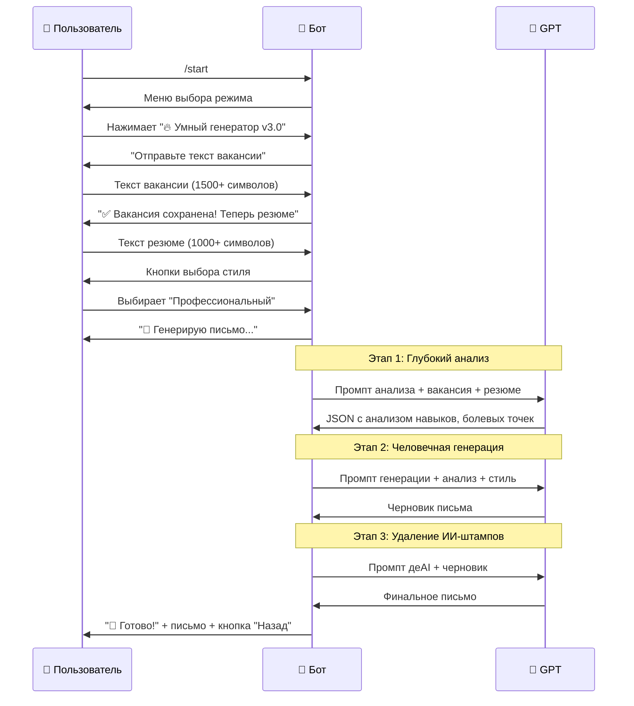

# 🤖 LetterGenius Bot - Архитектура и Взаимодействие

## 📋 Что делает бот?

**LetterGenius** - это умный бот для создания сопроводительных писем. Пользователь присылает текст вакансии и свое резюме, а бот создает персональное письмо.

## 🎯 Три режима работы

### 1. ⚡ Классический режим
- **Простой и быстрый**
- Пользователь → Вакансия → Резюме → Выбор стиля → Готовое письмо
- Базовый промпт без глубокого анализа

### 2. 🎯 Персонализированный режим  
- **Анализирует профессию и уровень**
- Определяет кто вы: Junior/Middle/Senior разработчик, дизайнер, PM
- Подбирает стиль письма под вашу роль
- Использует заготовленную матрицу стилей

### 3. 🔥 Умный генератор v3.0 (NEW!)
- **Самый продвинутый режим**
- 3-этапная обработка через GPT:
  1. Глубокий анализ вакансии и резюме
  2. Генерация человечного текста
  3. Удаление ИИ-штампов
- Результат: письмо неотличимое от написанного человеком

---

## 🏗️ Архитектура проекта

```
tg_soprovod/
├── 🚀 main.py                    # Запуск бота, настройка handlers
├── ⚙️ config.py                  # Конфигурация, состояния, API ключи
├── 
├── 📁 handlers/                  # Обработчики сообщений
│   ├── start.py                  # Команда /start, главное меню
│   ├── callback.py               # Обработка кнопок (inline клавиатура)
│   ├── conversation.py           # Классический режим
│   ├── personalized_conversation.py # Персонализированный режим
│   └── v3_conversation.py        # v3.0 умный режим
│
├── 📁 services/                  # Бизнес-логика
│   ├── openai_service.py         # Работа с OpenAI API
│   ├── smart_analyzer.py         # v3.0 умный анализ (3 промпта)
│   ├── profile_analyzer.py       # Анализ профессии/уровня
│   └── personalized_prompt.py    # Персонализированные промпты
│
├── 📁 models/                    # Модели данных
│   ├── profile_models.py         # Структуры профилей пользователей
│   └── style_definitions.py      # Матрица стилей для ролей
│
└── 📁 utils/                     # Вспомогательные функции
    ├── keyboards.py              # Inline клавиатуры
    └── prompts.py                # Базовые промпты
```

---

## 🔄 Как работает взаимодействие

### Пример: Пользователь выбирает v3.0 режим



---

## 🧠 v3.0 - Детали умного анализа

### Этап 1: Глубокий анализ (`DEEP_ANALYSIS_PROMPT`)
**Что делает GPT:**
- Анализирует вакансию: требования, болевые точки компании, культуру
- Анализирует резюме: навыки, достижения с метриками, USP
- Сопоставляет: находит совпадения, пробелы, стратегию позиционирования
- **Результат:** Структурированный JSON с полным анализом

### Этап 2: Человечная генерация (`HUMAN_WRITING_PROMPT`)  
**Что делает GPT:**
- Использует анализ из этапа 1
- Пишет естественным языком без ИИ-клише
- Добавляет конкретные примеры и метрики
- Создает интригующее начало и логичную структуру
- **Результат:** Черновик письма

### Этап 3: ДеAI-фикация (`DEAI_PROMPT`)
**Что делает GPT:**
- Находит и заменяет ИИ-штампы типа "хотел бы выразить заинтересованность"
- Делает переходы между предложениями естественными  
- Добавляет живые детали и эмоциональность
- **Результат:** Финальное письмо, неотличимое от человеческого

---

## 🔧 Технические детали

### ConversationHandler (Управление диалогами)
```python
# Каждый режим = отдельный ConversationHandler с состояниями:

# v3.0 режим:
V3_VACANCY_INPUT = 100   # Ожидание вакансии
V3_RESUME_INPUT = 101    # Ожидание резюме  
V3_STYLE_SELECT = 102    # Выбор стиля

# Классический режим:
WAITING_JOB_DESCRIPTION = 1
WAITING_RESUME = 2
WAITING_STYLE_CHOICE = 3
```

### Приоритет обработчиков
1. **v3_conversation_handler** (добавляется первым)
2. **main_conversation_handler** (классический + персонализированный)
3. **debug_handler** (логирование)

### Ключевые сервисы
- **OpenAIService**: Единая точка работы с GPT, retry логика, fallback модели
- **SmartAnalyzer**: 3-этапный анализ для v3.0
- **ProfileAnalyzer**: Определение роли пользователя (PM, разработчик, дизайнер)

---

## 🎮 Пользовательский опыт

### Что видит пользователь:

1. **Команда /start** → Красивое меню с 3 режимами
2. **Выбор режима** → Понятные инструкции что делать дальше  
3. **Ввод данных** → Валидация текста, понятные ошибки
4. **Генерация** → Прогресс-бар с описанием этапов
5. **Результат** → Готовое письмо + кнопка "Начать заново"

### Что происходит "под капотом":

1. **Роутинг** → Определение какой handler обрабатывает запрос
2. **Валидация** → Проверка длины текста, наличия данных
3. **Сохранение** → Данные в `context.user_data` между этапами
4. **Обработка** → Вызов нужного сервиса (OpenAI, анализаторы)
5. **Форматирование** → Красивый вывод с HTML разметкой

---

## 🚀 Эволюция проекта

### v1.0 → v2.0: Персонализация
- Добавили анализ профессии через промпты
- Создали матрицу стилей для разных ролей
- Улучшили качество писем

### v2.0 → v3.0: Умный анализ  
- **Ключевое решение:** Отказались от сложных парсеров в пользу умных промптов
- 3-этапная обработка через GPT
- Человечные тексты без ИИ-штампов
- Сократили разработку с 8 до 3 недель

---

## 💡 Философия проекта

**"Зачем писать код, если GPT может это сделать лучше?"**

Вместо создания сложных парсеров вакансий и резюме, мы используем силу GPT для анализа. Это:
- ✅ Быстрее в разработке
- ✅ Гибче в обработке разных форматов
- ✅ Лучше понимает контекст и нюансы
- ✅ Легче поддерживать и улучшать

**Результат:** Простой, но мощный бот, который создает письма качества человека за 30 секунд.

---

## 🔮 Планы развития

1. **Интеграция с LinkedIn** - парсинг вакансий напрямую
2. **Мультиязычность** - письма на английском/других языках  
3. **Обратная связь** - улучшение через пользовательские оценки
4. **API режим** - интеграция с другими сервисами
5. **Веб-интерфейс** - альтернатива Telegram боту 