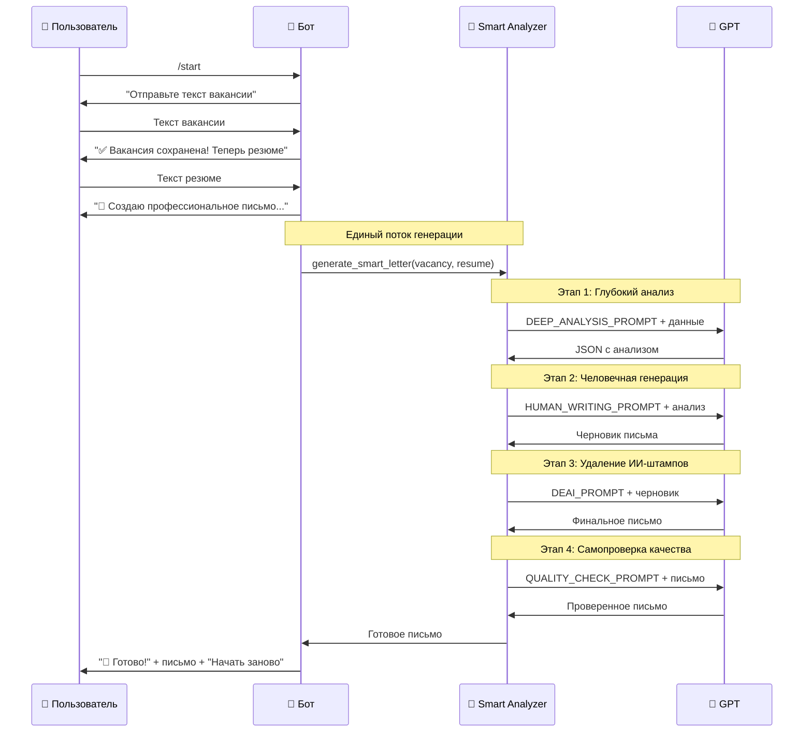

# 🤖 LetterGenius Bot v4.0 - Архитектура и Взаимодействие

## 📋 Что делает бот?

**LetterGenius v4.0** - это умный бот для создания сопроводительных писем, максимально упрощенный для использования. Пользователь присылает текст вакансии и свое резюме, а бот создает профессиональное персональное письмо за 30 секунд.

## 🎯 Единственный режим работы v4.0

### ⚡ Простой Поток
- **Максимально простой и быстрый**
- Пользователь → /start → Вакансия → Резюме → Готовое письмо
- Умный анализ через smart_analyzer (сохранена вся мощь v3.0)
- Единый профессиональный стиль для всех случаев
- Встроенная система самопроверки качества

### ❌ Что убрали в v4.0:
- **Выбор режимов** - никаких меню, сразу к делу
- **Выбор стилей** - один оптимальный стиль для всех
- **Матрица профессий** - универсальный подход
- **Сложные обработчики** - простая линейная логика

### ✅ Что сохранили и улучшили:
- **smart_analyzer.py** - вся мощь 3-этапного анализа
- **Система проверки** - новая 4-этапная валидация
- **Качество генерации** - человечные тексты без ИИ-штампов
- **OpenAI интеграция** - надежная работа с API

---

## 🏗️ Архитектура проекта v4.0

```
tg_soprovod/
├── 🚀 main.py                    # Упрощенный запуск бота
├── ⚙️ config.py                  # Конфигурация, API ключи
├── 
├── 📁 handlers/                  # Единый обработчик
│   └── simple_conversation.py    # Простой поток: вакансия → резюме → письмо
│
├── 📁 services/                  # Бизнес-логика
│   ├── openai_service.py         # Работа с OpenAI API
│   └── smart_analyzer.py         # v3.0 умный анализ (сохранен)
│
├── 📁 utils/                     # Вспомогательные функции
│   ├── keyboards.py              # Простые клавиатуры
│   └── prompts.py                # Улучшенный промпт с системой проверки
│
└── 📁 models/                    # Deprecated в v4.0
    └── __init__.py
```

---

## 🔄 Как работает взаимодействие v4.0

### Упрощенный пользовательский флоу



---

## 🧠 v4.0 - Детали умного анализа

### Сохранена вся мощь v3.0 + улучшения

#### Этап 1: Глубокий анализ (из v3.0)
**Что делает GPT:**
- Анализирует вакансию: требования, болевые точки компании
- Анализирует резюме: навыки, достижения с метриками
- Сопоставляет: находит совпадения, пробелы, стратегию
- **Результат:** Структурированный JSON с полным анализом

#### Этап 2: Человечная генерация (из v3.0)
**Что делает GPT:**
- Использует анализ из этапа 1
- Пишет естественным языком без ИИ-клише
- Добавляет конкретные примеры и метрики
- **Результат:** Черновик письма

#### Этап 3: ДеAI-фикация (из v3.0)
**Что делает GPT:**
- Находит и заменяет ИИ-штампы
- Делает переходы естественными
- Добавляет живые детали
- **Результат:** Человечное письмо

#### Этап 4: Система самопроверки (НОВОЕ в v4.0)
**Что делает GPT:**
- Проверяет синтаксис и логику
- Оценивает привлекательность для рекрутера
- Ищет повторы, штампы, преувеличения
- Проверяет фактическую точность
- **Результат:** Идеально проверенное письмо

---

## 🔧 Технические детали v4.0

### ConversationHandler (Упрощенный)
```python
# Всего 2 состояния:
WAITING_VACANCY = 1    # Ожидание вакансии
WAITING_RESUME = 2     # Ожидание резюме

# Обработчики:
start()              # /start с приветствием  
handle_vacancy()     # Получение вакансии
handle_resume()      # Получение резюме + генерация
cancel()             # Отмена процесса
```

### Система проверки качества
```python
# Встроенная в промпт система валидации:
СИСТЕМА ПРОВЕРКИ ПИСЬМА:
1. СИНТАКСИС И ЛОГИКА: Нет ли нарушений?
2. ПРИВЛЕКАТЕЛЬНОСТЬ: Позвал бы рекрутер на интервью?  
3. КАЧЕСТВО ТЕКСТА: Нет ли повторов, штампов?
4. ФАКТИЧЕСКАЯ ТОЧНОСТЬ: Соответствует ли опыту?

Если на любой вопрос ответ НЕТ - переписывай до идеала.
```

### Ключевые сервисы
- **OpenAIService**: Единая точка работы с GPT, retry логика
- **SmartAnalyzer**: 3-этапный анализ + новая система проверки
- **Простые Keyboards**: Только кнопка "Начать заново"

---

## 🎮 Пользовательский опыт v4.0

### Что видит пользователь:

1. **Команда /start** → Простое приветствие с инструкцией
2. **Ввод вакансии** → Понятная валидация и подтверждение
3. **Ввод резюме** → Запуск генерации с прогрессом
4. **Результат** → Готовое письмо + кнопка "Начать заново"

### Что происходит "под капотом":

1. **Валидация** → Проверка длины текста (100+ символов)
2. **Сохранение** → Данные в `context.user_data`
3. **Генерация** → Вызов SmartAnalyzer с 4-этапным процессом
4. **Форматирование** → Красивый вывод письма

---

## 🚀 Эволюция проекта

### v1.0 → v2.0: Персонализация
- Добавили анализ профессии через промпты
- Создали матрицу стилей для разных ролей

### v2.0 → v3.0: Умный анализ  
- 3-этапная обработка через GPT
- Человечные тексты без ИИ-штампов
- Сложные обработчики и режимы

### v3.0 → v4.0: Упрощение + Качество
- **Убрали сложность**: один режим, один стиль, простой флоу
- **Сохранили качество**: весь smart_analyzer + система проверки
- **Добавили валидацию**: 4-этапная самопроверка GPT
- **Ускорили разработку**: 70 минут вместо недель

---

## 💡 Философия v4.0

**"Простота - высшая форма сложности"**

Принцип v4.0: убрать всё лишнее, оставить только самое важное.

### Что пользователь получает:
- ✅ **Простоту v1.0**: 2 шага без выбора
- ✅ **Качество v3.0**: умный анализ + система проверки  
- ✅ **Скорость**: 30 секунд от старта до результата
- ✅ **Надежность**: встроенная валидация качества

### Что разработчик получает:
- ✅ **Простую архитектуру**: один handler, линейный флоу
- ✅ **Легкую поддержку**: один режим вместо трех
- ✅ **Быструю разработку**: 70 минут реализации
- ✅ **Меньше ошибок**: простая логика без ветвлений

---

## 📊 Сравнение версий

| Параметр | v3.0 | v4.0 |
|----------|------|------|
| Режимы | 3 сложных | 1 простой |
| Стили | 4 на выбор | 1 оптимальный |
| Состояния | 14 | 2 |
| Handlers | 5 файлов | 1 файл |
| UX | Много выборов | Прямо к делу |
| Качество | Отличное | Отличное + проверка |
| Скорость разработки | Недели | 70 минут |
| Сложность поддержки | Высокая | Низкая |

---

## 🔮 Планы развития

1. **Мультиязычность** - письма на английском/других языках  
2. **Интеграция с LinkedIn** - парсинг вакансий напрямую
3. **Обратная связь** - улучшение через пользовательские оценки
4. **API режим** - интеграция с другими сервисами
5. **Веб-интерфейс** - альтернатива Telegram боту

---

## 🎯 Выводы

**LetterGenius v4.0** - это эволюция в сторону простоты и элегантности:

- **Пользователь** получает максимально простой опыт без компромиссов в качестве
- **Разработчик** получает простую архитектуру, легкую в поддержке и развитии
- **Бизнес** получает быструю разработку и меньше ошибок

**Результат**: Элегантный бот, который делает одно дело, но делает его идеально. 