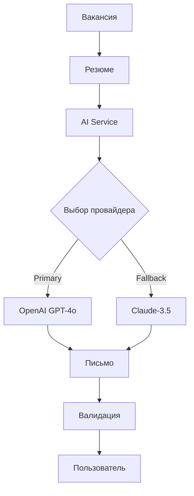
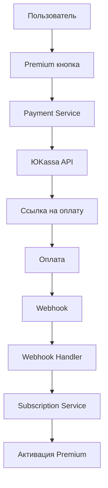

# 🏗️ Техническая архитектура

> **Системная архитектура AI Telegram бота для генерации сопроводительных писем**

## 🔧 ТЕХНИЧЕСКИЙ СТЕК

### **Core Technologies**
- **Python 3.11+** - основной язык разработки
- **python-telegram-bot** - Telegram Bot API framework
- **Supabase** - PostgreSQL база данных + realtime
- **Railway** - deployment platform
- **Redis** - кеширование и rate limiting (optional)
- **FastAPI** - webhook server для платежей
- **ЮKassa** - платежная система

### **AI Providers**
- **OpenAI GPT-4o** - основной AI провайдер
- **Anthropic Claude-3.5** - fallback AI провайдер
- **Dual Provider Architecture** - автоматическое переключение при сбоях

## 📁 АРХИТЕКТУРА КОДА

```
tg_soprovod/
├── 🎯 main.py              # Entry point
├── ⚙️ config.py           # Configuration
├── 🗂️ handlers/           # Telegram handlers
│   └── simple_conversation_v6.py
├── 🛠️ services/           # Business logic
│   ├── ai_service.py       # AI orchestration
│   ├── subscription_service.py
│   ├── payment_service.py  # ЮKassa integration
│   ├── analytics_service.py
│   └── feedback_service.py
├── 📊 models/             # Data models
├── 🔧 utils/              # Utilities
│   ├── validators.py
│   ├── rate_limiter.py
│   └── keyboards.py
├── 🌐 webhook_handler.py  # FastAPI webhook server
└── 🗄️ migrations/         # Database migrations
```

## 🔄 ПРОЦЕСС ГЕНЕРАЦИИ



## 💳 ПЛАТЕЖНАЯ СИСТЕМА



## 🗄️ БАЗА ДАННЫХ

### **Основные таблицы:**
- `users` - пользователи бота
- `subscriptions` - подписки и лимиты
- `payments` - платежи (расширена для ЮKassa)
- `letter_sessions` - сессии генерации писем
- `user_feedback` - обратная связь
- `analytics_events` - события аналитики

### **Новые поля в payments:**
- `payment_method` - способ оплаты (yookassa, manual)
- `confirmation_url` - ссылка на оплату
- `metadata` - дополнительные данные (JSONB)
- `updated_at` - время обновления

### **Новые поля в subscriptions:**
- `payment_id` - связь с платежом
- `upgraded_at` - время апгрейда

### **Views:**
- `user_cohorts_basic` - аналитика когорт пользователей
- `user_feedback_stats` - статистика обратной связи
- `payment_analytics` - аналитика платежей

## 🔒 БЕЗОПАСНОСТЬ

- **Rate Limiting:** 5 команд/мин, 3 AI запроса/5мин
- **PII Санитизация:** Удаление персональных данных из логов
- **Input Validation:** Максимум 50KB текста
- **GDPR Compliance:** Согласие на обработку ПД
- **Payment Security:** Проверка подписи webhook'ов ЮKassa
- **Webhook Protection:** Валидация и rate limiting для webhook endpoints

## 📊 АНАЛИТИКА

- **User Journey Tracking** - отслеживание пути пользователя
- **Conversion Metrics** - метрики конверсии в Premium
- **Payment Analytics** - аналитика платежей и конверсии
- **AI Performance** - качество и скорость генерации
- **Error Monitoring** - мониторинг ошибок

## 🚀 DEPLOYMENT

- **Platform:** Railway
- **Environment:** Production
- **Auto-deploy:** Git push → Railway deploy
- **Database:** Supabase PostgreSQL
- **Webhook Server:** FastAPI на порту 8000
- **Payment Integration:** ЮKassa с webhook обработкой

## 🔄 РЕЛИЗНАЯ СИСТЕМА

- **Структура релизов:** `releases/vX_feature_name/`
- **Миграции:** В папке релиза с rollback планами
- **Документация:** README.md, DEPLOYMENT.md, CHANGELOG.md
- **Тестирование:** Unit, Integration, Load testing
- **Rollback:** Автоматический откат при проблемах

---

**Принципы:** Simple, Scalable, Secure, Sustainable, Payment-Ready 