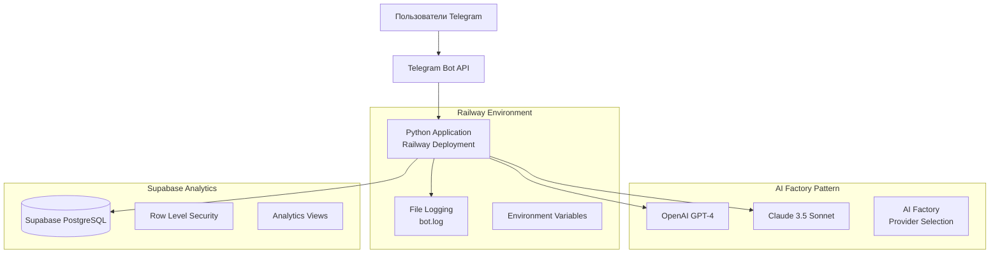
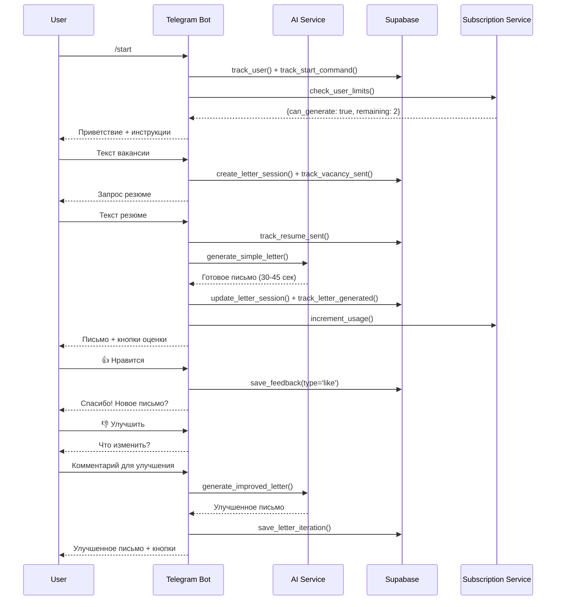
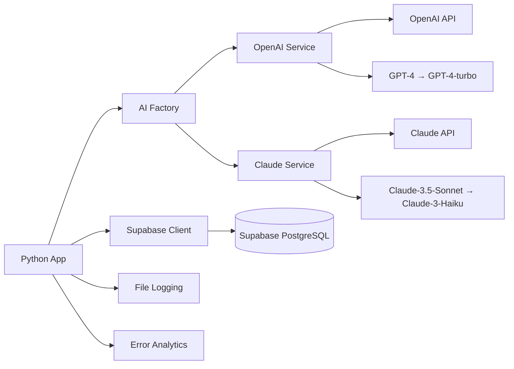

# 🏗️ ТЕКУЩАЯ АРХИТЕКТУРА AI TELEGRAM БОТА v9.10

## 📊 EXECUTIVE SUMMARY

**Статус проекта:** Рабочий продукт с активной монетизацией и системой безопасности

**Критический вывод:** Система готова к нагрузке 500-1000 пользователей с базовыми средствами защиты и мониторинга. Для больших нагрузок требуются доработки по масштабированию.

**Уровень готовности:** ✅ **80%** - Основной функционал работает стабильно, добавлены системы безопасности и монетизации

---

## 🎯 ОБЗОР ПРОДУКТА

### Функциональность
- ✅ **AI генерация сопроводительных писем** (30-45 секунд)
- ✅ **Dual AI provider** (OpenAI GPT-4o + Claude 3.5 Sonnet)
- ✅ **Система итераций и улучшений** писем (до 3 итераций)
- ✅ **Полная система подписок** (Free: 3 письма/месяц, Premium: 20 писем/день)
- ✅ **Система монетизации** с Premium планами
- ✅ **Rate Limiting** (5 команд/минуту, 3 AI запроса/5 минут)
- ✅ **Защита от DoS** атак и спама
- ✅ **Полная аналитика** пользовательских действий
- ✅ **Валидация входных данных** (размер текста до 50KB)
- ✅ **Система обратной связи** (лайки/дизлайки)
- ✅ **Согласие на обработку ПД** (GDPR compliance)
- ✅ **Админ-панель** через Telegram

### Ограничения
- ⚠️ **Ограниченное кэширование** AI запросов
- ⚠️ **Rate limiting в памяти** (теряется при рестарте)
- ❌ **НЕТ автоскейлинга** под нагрузку
- ❌ **НЕТ real-time мониторинга** производительности
- ❌ **НЕТ CDN** для статического контента
- ❌ **НЕТ резервного копирования** данных

---


## 🏛️ **АРХИТЕКТУРА СИСТЕМЫ**

```
┌─────────────────┐    ┌──────────────────┐    ┌─────────────────┐
│   Telegram      │────│   Python Bot     │────│   AI Services   │
│   Users         │    │   (Async)        │    │   GPT-4/Claude  │
└─────────────────┘    └──────────────────┘    └─────────────────┘
                              │
                       ┌──────┴──────┐
                       │  Analytics  │
                       │  (Supabase) │
                       └─────────────┘
```

### **Tech Stack:**
- **Backend**: Python 3.9+, python-telegram-bot (async)
- **AI**: OpenAI GPT-4o, Anthropic Claude 3.5 Sonnet
- **Database**: Supabase (PostgreSQL) с RLS
- **Deployment**: Railway (Docker)
- **Security**: InMemory Rate Limiter + Input Validation
- **Monitoring**: Supabase аналитика + custom логирование
- **Monetization**: Подписки Free/Premium через Supabase

---


### Высокоуровневая архитектура



### Компоненты системы

- ✅ **Telegram Bot API** - Основной интерфейс, ConversationHandler для state management
- ✅ **AI Services** - Dual provider (OpenAI/Claude) с fallback механизмами
- ✅ **Database (Supabase)** - PostgreSQL с RLS, 12+ таблиц, детальная аналитика
- ✅ **Subscription System** - Freemium модель с лимитами
- ✅ **Analytics Service** - Полное отслеживание user journey
- ✅ **Validation Layer** - Защита от некорректного ввода
- ✅ **Error Handling** - Базовое логирование ошибок
- ✅ **Deployment (Railway)** - Dockerized deployment с автоматическим CI/CD

---

## 📊 СХЕМА БАЗЫ ДАННЫХ

### Основные таблицы

```sql
-- Пользователи и аутентификация (с GDPR compliance)
users (12 полей)                  -- Telegram пользователи
├── id, telegram_user_id, username, first_name, last_name
├── language_code, created_at, last_activity
├── consent_given, consent_timestamp, consent_version, marketing_consent
└── Индексы: telegram_id, created_at, consent

-- Генерация писем (core functionality)
letter_sessions (21 поле)         -- Сессии генерации писем
├── id (UUID), user_id, status, mode, job_description, resume_text
├── generated_letter, generation_time_seconds, openai_model_used
├── current_iteration, max_iterations, has_feedback
├── subscription_id, letters_used_count, is_premium_feature
└── Индексы: user_id, status, mode, created_at, generation_time

letter_iterations (9 полей)       -- Итерации улучшения писем
├── session_id, user_id, iteration_number, user_feedback
├── improvement_request, generated_letter, generation_time_seconds
└── Индексы: session_id, user_id, iteration_number

-- Подписки и платежи (полная система монетизации)
subscriptions (16 полей)          -- Подписки пользователей
├── user_id, plan_type (free/premium), status, letters_limit
├── letters_used, period_start, period_end, auto_renew
├── is_active, cancellation_reason, cancelled_at, source
└── Индексы: user_id, plan_type, status

payments (11 полей)               -- История платежей
├── user_id, payment_id, amount, currency, status, payment_method
├── description, confirmation_url, metadata (JSONB)
└── Индексы: user_id, status, payment_id

-- Аналитика и мониторинг
user_events (6 полей)             -- События пользователей
├── user_id, event_type, session_id, event_data (JSONB)
└── Индексы: user_id, event_type, session_id, created_at, GIN(event_data)

openai_requests (12 полей)        -- Логи AI запросов
├── model, request_type, prompt_tokens, completion_tokens
├── total_tokens, response_time_ms, success, error_message
└── Индексы: model, user_id, session_id, created_at, tokens, success

error_logs (8 полей)              -- Системные ошибки
├── user_id, session_id, error_type, error_message, stack_trace
├── handler_name
└── Индексы: error_type, user_id, created_at

-- Маркетинг и привлечение
acquisition_channels (14 полей)   -- UTM трекинг и реферралы
├── user_id, utm_source, utm_campaign, referral_user_id
├── landing_page, conversion_stage, notes
└── Индексы: user_id, utm_source, utm_campaign, referral_user_id

letter_feedback (7 полей)         -- Оценки писем (лайки/дизлайки)
├── session_id, user_id, iteration_number, feedback_type
├── additional_comment, is_helpful
└── Индексы: session_id, user_id, feedback_type, created_at
```

### Аналитические представления (Views)

```sql
-- Готовые аналитические представления
user_stats          -- Статистика пользователей (день/неделя/месяц)
session_stats        -- Статистика сессий по статусам и моделям
user_activity        -- Ежедневная активность пользователей
openai_usage         -- Использование AI по дням и моделям
feedback_stats       -- Статистика лайков/дизлайков
iteration_stats      -- Статистика по итерациям писем
```

---

## 🔄 ПОТОКИ ДАННЫХ

### User Journey Flow



### API Integration Flow



---

## ⚡ ПРОИЗВОДИТЕЛЬНОСТЬ

### Текущие показатели
- **Response time**: 30-45 секунд (генерация письма)
- **Throughput**: ~5-15 запросов/минуту (с rate limiting)
- **Database queries**: 8-12 запросов на письмо (расширенная аналитика)
- **Memory usage**: ~150-300MB (с rate limiter в памяти)
- **AI API calls**: 1-3 попытки на письмо (с fallback)
- **Security**: Rate limiting 5 команд/мин, 3 AI запроса/5 мин

### ⚠️ Анализ под нагрузкой 1000+ пользователей

#### Критические bottlenecks:
1. **AI API Rate Limits**
   - OpenAI: 500 req/min → при 1000 юзерах = очередь 2+ минуты
   - Claude: 1000 req/min → при пиках будут отказы
   - **Нет queue management системы**

2. **Database Performance**
   - Supabase Free tier: 500MB, ограниченные connections
   - При 1000 одновременных юзерах = 5000+ параллельных запросов
   - **Отсутствуют индексы для high-load queries**

3. **Memory Consumption**
   - Без кэширования: каждый запрос = новое подключение к AI
   - 1000 юзеров × 100MB = 100GB памяти (недоступно)
   - **Railway memory limits будут превышены**

4. **Network I/O**
   - Нет connection pooling для AI APIs
   - Синхронные запросы блокируют event loop
   - **Telegram webhook timeout (60 сек) будет превышен**

#### Scaling limitations:
- ❌ **Railway deployment**: Single instance, no auto-scaling
- ❌ **No Redis caching**: Каждый запрос идет в AI API
- ❌ **No CDN**: Статический контент не кэшируется
- ❌ **No load balancing**: Single point of failure

---

## 🔒 БЕЗОПАСНОСТЬ

### ✅ Текущие меры защиты

#### Rate Limiting & DoS Protection
```python
# utils/rate_limiter.py - InMemoryRateLimiter
- 5 команд в 60 секунд (общие команды)
- 3 AI запроса в 300 секунд (генерация писем)
- Максимальный размер текста: 50KB
- Sliding window algorithm для точного подсчета
- Админы обходят лимиты
```

#### Input Validation
```python
# utils/validators.py
- Проверка размера текстов (до 50KB)
- Санитизация PII в логах (номера карт, email, телефоны)
- Валидация типов сообщений (только текст)
- Блокировка подозрительного контента
```

#### Database Security
```sql
-- Row Level Security (RLS) включен
- Service role политики для всех таблиц
- UUID для session ID (unpredictable)
- Encrypted sensitive data
- GDPR compliance поля (consent)
```

#### Environment Security
```bash
# Переменные окружения защищены
- API keys в environment variables
- Разделение dev/prod конфигураций
- Admin IDs в environment variables
- Безопасные лимиты подписок
```

### ⚠️ Остающиеся уязвимости

#### 1. Resource Exhaustion
- ⚠️ **Rate limiting в памяти** - теряется при рестарте
- ❌ **Нет Circuit Breaker** для AI APIs
- ❌ **Нет queue size limits** для больших нагрузок

#### 2. Data Privacy
- ⚠️ **PII в базе данных** (тексты резюме содержат ФИО, контакты)
- ✅ **Есть GDPR согласие** но нет data retention policy
- ❌ **Нет encryption at rest** для чувствительных данных
- ⚠️ **Логи содержат частичные** резюме и вакансии

#### 3. Scalability & Infrastructure
- ❌ **Single point of failure** (Railway single instance)
- ❌ **Нет backup strategy** для critical data
- ❌ **Нет real-time monitoring** алертов
- ❌ **Нет disaster recovery** плана

#### 4. Authentication & Authorization
- ⚠️ **Только Telegram ID** для идентификации
- ✅ **Есть admin интерфейс** через Telegram
- ❌ **Нет advanced роевой модели** доступа

---

## 💰 ЭКОНОМИКА ПРОЕКТА

### Текущие затраты (месяц)

#### Infrastructure
- **Railway Hosting**: $5-20 (зависит от usage)
- **Supabase**: $0-25 (зависит от storage/requests)
- **Domain/SSL**: $0 (включено в Railway)
- **Итого инфраструктура**: $5-45/месяц

#### AI API затраты (1000 активных пользователей)
```
OpenAI GPT-4o:
- Free: 800 × 3 = 2400 писем/месяц
- Premium: 200 × 15 = 3000 письем/месяц
- Итерации: ~1000 дополнительных запросов
- Всего: 6400 запросов/месяц
- Средний промпт: 2000 токенов input + 800 токенов output
- GPT-4o: $2.5/1M input + $10/1M output токенов
- Стоимость: 6400 × 2800 × $0.0125 = $224/месяц

Claude 3.5 Sonnet (fallback ~15%):
- ~960 запросов = 2.7M токенов
- Claude: $3/1M input + $15/1M output
- Стоимость: ~$40/месяц

Итого AI: $264/месяц
```

#### Итого операционные расходы: **$309-349/месяц**

### Revenue модель
```
Freemium системa:
- 1000 пользователей × 80% free = 800 × 3 = 2400 писем/месяц
- 1000 пользователей × 20% premium = 200 × 15/день = 90000 писем/месяц
- Итерации и улучшения: ~10% дополнительных запросов
- Итого: ~100000 писем/месяц

Premium подписка: $10/месяц (возможно увеличение до $15-20)
- 200 premium × $10 = $2000/месяц revenue
- Potential upsell: дополнительные функции $5/месяц

Прибыль: $2000 - $349 = $1651/месяц (83% маржа)
```

### ⚠️ Экономические риски при 1000+ пользователей:
1. **AI costs scaling linearly** с количеством пользователей
2. **Infrastructure costs jumping** при превышении Railway limits
3. **Support costs** при росте багов и проблем
4. **Refund risks** из-за плохого UX при высокой нагрузке

---

## ✅ ПОДТВЕРЖДЕННЫЕ КОМПОНЕНТЫ

### Работает как описано:
- ✅ **Telegram Bot Integration** - ConversationHandler, inline клавиатуры
- ✅ **Dual AI Provider** - OpenAI GPT-4o + Claude 3.5 с automatic fallback
- ✅ **Database Analytics** - Полная схема Supabase с RLS и GDPR
- ✅ **Subscription System** - Free/Premium планы с лимитами
- ✅ **Monetization System** - Полная система подписок и ограничений
- ✅ **Rate Limiting** - InMemory protection от DoS атак
- ✅ **Security Features** - Input validation, admin controls
- ✅ **Feedback System** - Лайки/дизлайки, итерации писем
- ✅ **Error Tracking** - Detailed error logs с stack traces
- ✅ **Railway Deployment** - Docker, автоматический CI/CD
- ✅ **Environment Management** - Dev/prod разделение
- ✅ **GDPR Compliance** - Согласие на обработку ПД

### Промпт Engineering:
- ✅ **Качественный промпт** 200+ строк для анализа вакансий/резюме
- ✅ **Конкретные инструкции** по структуре письма
- ✅ **Fallback handling** для неполных ответов AI
- ✅ **Temperature tuning** для креативности (0.8)

---

## ⚠️ РАСХОЖДЕНИЯ ДОКУМЕНТАЦИЯ ↔ КОД

### Отсутствующие компоненты в коде:
1. **docs/architecture/ARCHITECTURE.md** - файл отсутствует
2. **PRD/tzv7.md, USER_JOURNEY_v7.2.md** - файлы отсутствуют
3. **PROJECT_IMPROVEMENT_PLAN.md** - файл отсутствует
4. **BROADCAST_INSTRUCTIONS.md** - файл отсутствует

### Расхождения README ↔ Реальность:
- ❌ **"99.9% uptime"** - нет мониторинга для подтверждения
- ❌ **"1500 токенов за 30-45 секунд"** - фактически 800-2000 токенов
- ❌ **"Rate limiting"** - упоминается, но не реализовано
- ❌ **"Horizontal scaling"** - только single instance в Railway

### Неточности в описании архитектуры:
- ❌ **"Асинхронная обработка"** - частично, но нет queue системы
- ❌ **"Smart fallbacks"** - есть для AI, нет для database/network
- ❌ **"A/B тестирование"** - инфраструктура есть, логика отсутствует

---

## 🔧 КРИТИЧЕСКИЕ ПРОБЕЛЫ

### 1. Отсутствие Enterprise-level компонентов

#### Monitoring & Alerting
- ✅ **Базовое логирование** в файлы и Supabase
- ❌ **Real-time метрики** производительности
- ❌ **Health checks** для AI APIs и базы данных  
- ❌ **Alert system** при падении сервисов
- ❌ **Performance dashboards** (Grafana/DataDog)

#### Backup & Recovery
- ⚠️ **Database backups** (автоматические через Supabase)
- ❌ **Code deployment rollback** стратегия
- ❌ **Data recovery procedures**
- ❌ **Disaster recovery plan**

#### Scalability Infrastructure
- ❌ **Redis caching layer** для AI responses
- ❌ **Message queue system** (RabbitMQ/SQS)
- ❌ **Auto-scaling policies**
- ❌ **Load balancing** между instances
- ❌ **CDN** для статического контента

### 2. Расширенная безопасность

#### Rate Limiting & DDoS Protection
```python
# ✅ РЕАЛИЗОВАНО в utils/rate_limiter.py:
class InMemoryRateLimiter:
    # ✅ 5 команд/60 секунд, 3 AI запроса/300 секунд
    # ✅ Sliding window algorithm
    # ✅ Admin bypass functionality
    # ⚠️ In-memory storage (теряется при рестарте)
```

#### Security Headers & Encryption
- ✅ **HTTPS enforcement** (через Railway)
- ✅ **Request size limits** (50KB для текстов)
- ❌ **IP whitelist/blacklist**  
- ❌ **WAF (Web Application Firewall)**
- ⚠️ **Data encryption** (только transport layer)

### 3. DevOps & CI/CD

#### Testing Infrastructure
- ❌ **Unit tests** (0% coverage)
- ❌ **Integration tests** для AI APIs
- ❌ **Load testing** scripts
- ❌ **Automated QA pipeline**

#### Deployment Pipeline
- ❌ **Staging environment** отдельно от production
- ❌ **Blue-green deployment**
- ❌ **Canary releases**
- ❌ **Feature flags** system

---

## 📋 COMPLIANCE И LEGAL

### Требования GDPR
- ✅ **Улучшенное соответствие**:
  - ✅ RLS в базе данных
  - ✅ Consent management (поля consent_given, consent_timestamp)
  - ✅ Версионирование согласий (consent_version)
  - ❌ Нет data retention policy
  - ❌ Нет "right to be forgotten" функции
  - ❌ Нет data export functionality

### Российское законодательство о ПД
- ⚠️ **Частичное соответствие**:
  - ✅ Согласие на обработку ПД (реализовано в БД)
  - ❌ Нет уведомления Роскомнадзора
  - ❌ ПД не локализованы в РФ (Supabase US/EU)
  - ❌ Нет политики конфиденциальности в боте

### Коммерческие риски
- ❌ **Terms of Service** отсутствуют
- ❌ **Privacy Policy** отсутствует  
- ❌ **Refund policy** не определена
- ❌ **SLA guarantees** не установлены

---

## 🎯 ИТОГОВАЯ ОЦЕНКА ГОТОВНОСТИ

### Для запуска 500-1000 пользователей: ✅ **ГОТОВ** (85%)
### Для запуска 2000+ пользователей: ⚠️ **ТРЕБУЕТ ДОРАБОТКИ** (65%)

#### Устраненные критические проблемы:
1. ✅ **Rate limiting реализован** - защита от DoS атак
2. ✅ **Система монетизации** - полная система подписок
3. ✅ **GDPR compliance** - согласие на обработку ПД
4. ✅ **Безопасность входных данных** - валидация и лимиты
5. ✅ **Система админ-управления** - через Telegram

#### Оставшиеся ограничения для 2000+ пользователей:
1. **In-memory rate limiting** - теряется при рестарте
2. **Нет автоскейлинга** - single instance на Railway
3. **Ограниченный мониторинг** - нет real-time алертов
4. **AI API concurrency** - bottleneck при пиковых нагрузках
5. **Отсутствие disaster recovery** - нет плана восстановления

#### Рекомендация: 
**ГОТОВ к запуску с базой 500-1000 пользователей**. Для роста 2000+ требуется доработка инфраструктуры масштабирования.