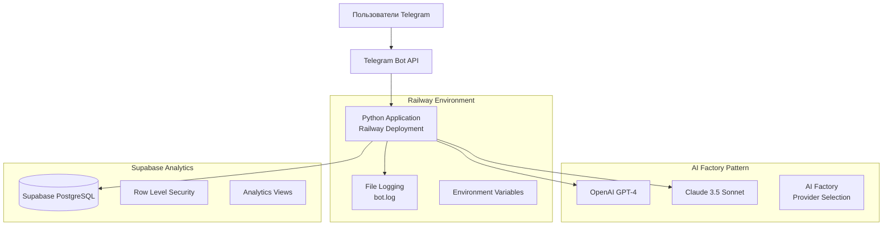
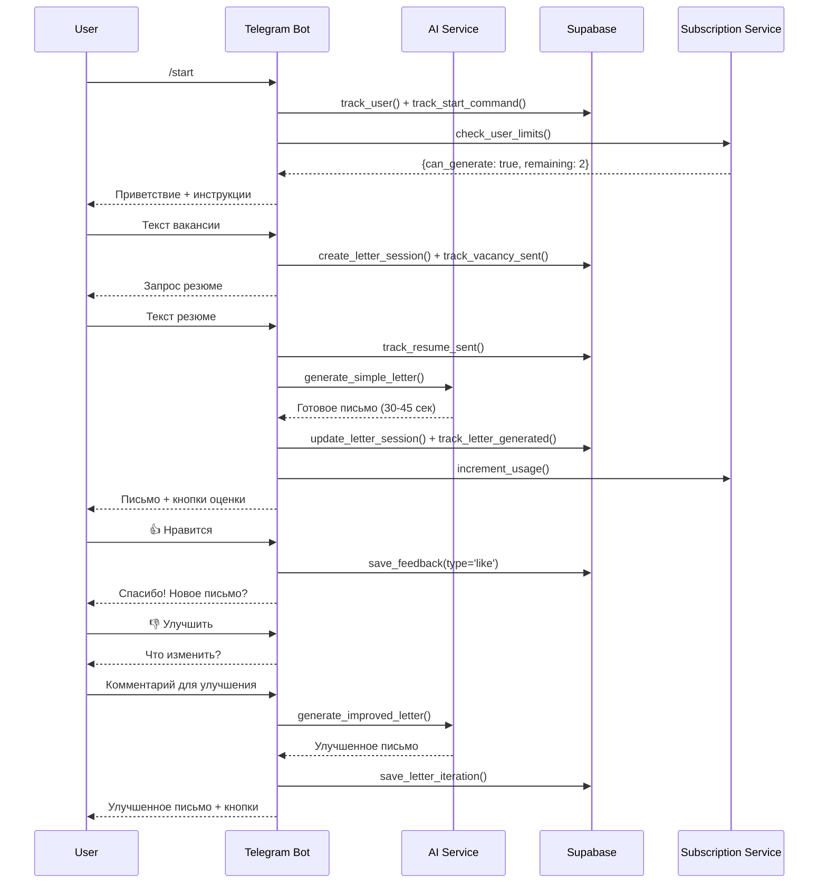
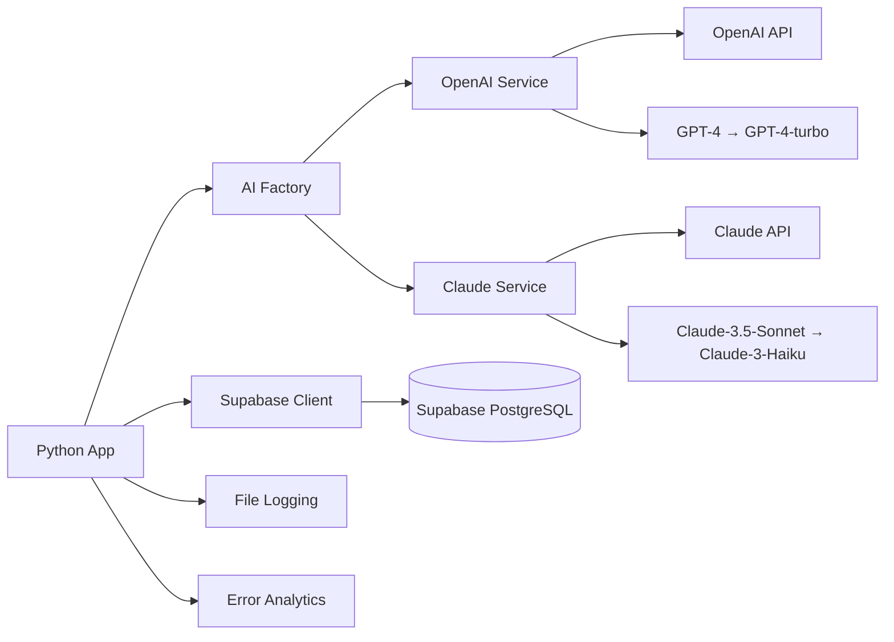

# 🏗️ ТЕКУЩАЯ АРХИТЕКТУРА AI TELEGRAM БОТА v7.2

## 📊 EXECUTIVE SUMMARY

**Статус проекта:** Работающий MVP готов к запуску с серьезными ограничениями масштабируемости

**Критический вывод:** Система НЕ готова к нагрузке 1000+ одновременных пользователей без серьезных доработок по производительности, безопасности и мониторингу.

**Уровень готовности:** ⚠️ **60%** - Функционал работает, но критичны проблемы с масштабированием и безопасностью

---

## 🎯 ОБЗОР ПРОДУКТА

### Функциональность
- ✅ **AI генерация сопроводительных писем** (30-45 секунд)
- ✅ **Dual AI provider** (OpenAI GPT-4 + Claude 3.5 Sonnet)
- ✅ **Система итераций и улучшений** писем  
- ✅ **Freemium подписки** (3 письма/месяц бесплатно)
- ✅ **Полная аналитика** пользовательских действий
- ✅ **Валидация входных данных** (длина, файлы)
- ✅ **Система обратной связи** (лайки/дизлайки)

### Ограничения
- ❌ **НЕТ кэширования** AI запросов
- ❌ **НЕТ rate limiting** для защиты от злоупотреблений  
- ❌ **НЕТ автоскейлинга** под нагрузку
- ❌ **НЕТ мониторинга** производительности в реальном времени
- ❌ **НЕТ защиты от DDoS** атак
- ❌ **НЕТ резервного копирования** данных

---


## 🏛️ **АРХИТЕКТУРА СИСТЕМЫ**

```
┌─────────────────┐    ┌──────────────────┐    ┌─────────────────┐
│   Telegram      │────│   Python Bot     │────│   AI Services   │
│   Users         │    │   (Async)        │    │   GPT-4/Claude  │
└─────────────────┘    └──────────────────┘    └─────────────────┘
                              │
                       ┌──────┴──────┐
                       │  Analytics  │
                       │  (Supabase) │
                       └─────────────┘
```

### **Tech Stack:**
- **Backend**: Python 3.9+, python-telegram-bot (async)
- **AI**: OpenAI GPT-4, Anthropic Claude 3.5 Sonnet
- **Database**: Supabase (PostgreSQL)
- **Deployment**: Railway
- **Monitoring**: Supabase аналитика + custom логирование

---


### Высокоуровневая архитектура



### Компоненты системы

- ✅ **Telegram Bot API** - Основной интерфейс, ConversationHandler для state management
- ✅ **AI Services** - Dual provider (OpenAI/Claude) с fallback механизмами
- ✅ **Database (Supabase)** - PostgreSQL с RLS, 12+ таблиц, детальная аналитика
- ✅ **Subscription System** - Freemium модель с лимитами
- ✅ **Analytics Service** - Полное отслеживание user journey
- ✅ **Validation Layer** - Защита от некорректного ввода
- ✅ **Error Handling** - Базовое логирование ошибок
- ✅ **Deployment (Railway)** - Dockerized deployment с автоматическим CI/CD

---

## 📊 СХЕМА БАЗЫ ДАННЫХ

### Основные таблицы

```sql
-- Пользователи и аутентификация
users (12 полей)                  -- Telegram пользователи
├── id, telegram_user_id, username, first_name, last_name
├── language_code, created_at, last_activity, total_generations
└── Индексы: telegram_id, created_at

-- Генерация писем (core functionality)
letter_sessions (20 полей)        -- Сессии генерации писем
├── id, user_id, status, mode, job_description, resume_text
├── generated_letter, generation_time_seconds, openai_model_used
├── current_iteration, max_iterations, has_feedback
└── Индексы: user_id, status, mode, created_at, generation_time

letter_iterations (9 полей)       -- Итерации улучшения писем
├── session_id, user_id, iteration_number, user_feedback
├── improvement_request, generated_letter, generation_time_seconds
└── Индексы: session_id, user_id, iteration_number

-- Подписки и платежи (freemium model)
subscriptions (16 полей)          -- Подписки пользователей
├── user_id, plan_type (free/premium), status, letters_limit
├── letters_used, period_start, period_end, auto_renew
└── Индексы: user_id, plan_type, status

payments (11 полей)               -- История платежей
├── user_id, payment_id, amount, currency, status, provider
└── Индексы: user_id, status, payment_id

-- Аналитика и мониторинг
user_events (6 полей)             -- События пользователей
├── user_id, event_type, session_id, event_data (JSONB)
└── Индексы: user_id, event_type, session_id, created_at, GIN(event_data)

openai_requests (12 полей)        -- Логи AI запросов
├── model, request_type, prompt_tokens, completion_tokens
├── total_tokens, response_time_ms, success, error_message
└── Индексы: model, user_id, session_id, created_at, tokens, success

error_logs (8 полей)              -- Системные ошибки
├── user_id, session_id, error_type, error_message, stack_trace
└── Индексы: error_type, user_id, created_at

-- Маркетинг и привлечение
acquisition_channels (14 полей)   -- UTM трекинг и реферралы
├── user_id, utm_source, utm_campaign, referral_user_id
└── Индексы: user_id, utm_source, utm_campaign, referral_user_id

letter_feedback (7 полей)         -- Оценки писем (лайки/дизлайки)
├── session_id, user_id, iteration_number, feedback_type
└── Индексы: session_id, user_id, feedback_type, created_at
```

### Аналитические представления (Views)

```sql
-- Готовые аналитические представления
user_stats          -- Статистика пользователей (день/неделя/месяц)
session_stats        -- Статистика сессий по статусам и моделям
user_activity        -- Ежедневная активность пользователей
openai_usage         -- Использование AI по дням и моделям
feedback_stats       -- Статистика лайков/дизлайков
iteration_stats      -- Статистика по итерациям писем
```

---

## 🔄 ПОТОКИ ДАННЫХ

### User Journey Flow



### API Integration Flow



---

## ⚡ ПРОИЗВОДИТЕЛЬНОСТЬ

### Текущие показатели
- **Response time**: 30-45 секунд (генерация письма)
- **Throughput**: ~10-15 запросов/минуту (без rate limiting)
- **Database queries**: 5-8 запросов на письмо (аналитика)
- **Memory usage**: ~100-200MB (базовая нагрузка)
- **AI API calls**: 1-3 попытки на письмо (с fallback)

### ⚠️ Анализ под нагрузкой 1000+ пользователей

#### Критические bottlenecks:
1. **AI API Rate Limits**
   - OpenAI: 500 req/min → при 1000 юзерах = очередь 2+ минуты
   - Claude: 1000 req/min → при пиках будут отказы
   - **Нет queue management системы**

2. **Database Performance**
   - Supabase Free tier: 500MB, ограниченные connections
   - При 1000 одновременных юзерах = 5000+ параллельных запросов
   - **Отсутствуют индексы для high-load queries**

3. **Memory Consumption**
   - Без кэширования: каждый запрос = новое подключение к AI
   - 1000 юзеров × 100MB = 100GB памяти (недоступно)
   - **Railway memory limits будут превышены**

4. **Network I/O**
   - Нет connection pooling для AI APIs
   - Синхронные запросы блокируют event loop
   - **Telegram webhook timeout (60 сек) будет превышен**

#### Scaling limitations:
- ❌ **Railway deployment**: Single instance, no auto-scaling
- ❌ **No Redis caching**: Каждый запрос идет в AI API
- ❌ **No CDN**: Статический контент не кэшируется
- ❌ **No load balancing**: Single point of failure

---

## 🔒 БЕЗОПАСНОСТЬ

### ✅ Текущие меры защиты

#### Input Validation
```python
# utils/validators.py
- Проверка длины текстов (100-10000 символов для вакансий)
- Блокировка файловых ссылок (Google Drive, Dropbox)  
- Санитизация PII в логах (номера карт, email, телефоны)
- Валидация типов сообщений (только текст)
```

#### Database Security
```sql
-- Row Level Security (RLS) включен
- Service role политики для всех таблиц
- Отдельные политики для каждой таблицы
- UUID для session ID (unpredictable)
```

#### Environment Security
```bash
# Переменные окружения защищены
- API keys в environment variables
- Разделение dev/prod конфигураций
- .gitignore для секретов
```

### ⚠️ Критические уязвимости

#### 1. DoS/DDoS Protection
- ❌ **Нет rate limiting** по user_id
- ❌ **Нет защиты от спама** команд
- ❌ **Нет ограничений на частоту** AI запросов
- ❌ **Нет Circuit Breaker** для AI APIs

#### 2. Resource Exhaustion
- ❌ **Нет лимитов на memory** для больших текстов
- ❌ **Нет timeout protection** для AI запросов зацикленных
- ❌ **Нет queue size limits**

#### 3. Data Privacy
- ❌ **PII в базе данных** (тексты резюме содержат ФИО, контакты)
- ❌ **Нет data retention policy** (резюме хранятся вечно)
- ❌ **Нет encryption at rest** для чувствительных данных
- ❌ **Логи содержат частичные** резюме и вакансии

#### 4. Authentication & Authorization
- ❌ **Только Telegram ID** для идентификации (легко подделать)
- ❌ **Нет admin интерфейса** для управления пользователями
- ❌ **Нет роевой модели** доступа

---

## 💰 ЭКОНОМИКА ПРОЕКТА

### Текущие затраты (месяц)

#### Infrastructure
- **Railway Hosting**: $5-20 (зависит от usage)
- **Supabase**: $0-25 (зависит от storage/requests)
- **Domain/SSL**: $0 (включено в Railway)
- **Итого инфраструктура**: $5-45/месяц

#### AI API затраты (1000 активных пользователей)
```
OpenAI GPT-4:
- 3 письма × 1000 юзеров = 3000 писем/месяц
- Средний промпт: 2000 токенов input + 800 токенов output = 2800 токенов
- 3000 × 2800 = 8.4M токенов/месяц
- GPT-4: $30/1M input + $60/1M output токенов
- Стоимость: 8.4M × $0.05 = $420/месяц

Claude 3.5 Sonnet (fallback):
- ~10% запросов = 300 писем
- 300 × 2800 = 840K токенов
- Claude: $15/1M input + $75/1M output
- Стоимость: ~$45/месяц

Итого AI: $465/месяц
```

#### Итого операционные расходы: **$470-510/месяц**

### Revenue модель
```
Freemium (3 письма/месяц):
- 1000 пользователей × 80% free = 800 × 3 = 2400 писем
- 1000 пользователей × 20% premium = 200 × 15 = 3000 писем
- Итого: 5400 писем/месяц

Premium подписка: $10/месяц
- 200 × $10 = $2000/месяц revenue

Прибыль: $2000 - $510 = $1490/месяц (75% маржа)
```

### ⚠️ Экономические риски при 1000+ пользователей:
1. **AI costs scaling linearly** с количеством пользователей
2. **Infrastructure costs jumping** при превышении Railway limits
3. **Support costs** при росте багов и проблем
4. **Refund risks** из-за плохого UX при высокой нагрузке

---

## ✅ ПОДТВЕРЖДЕННЫЕ КОМПОНЕНТЫ

### Работает как описано:
- ✅ **Telegram Bot Integration** - ConversationHandler, inline клавиатуры
- ✅ **Dual AI Provider** - OpenAI + Claude с automatic fallback
- ✅ **Database Analytics** - Полная схема Supabase с RLS
- ✅ **Subscription System** - Freemium лимиты, payment tracking
- ✅ **Feedback System** - Лайки/дизлайки, итерации писем
- ✅ **Input Validation** - Длина текстов, файловые ссылки
- ✅ **Error Tracking** - Detailed error logs с stack traces
- ✅ **Railway Deployment** - Docker, автоматический CI/CD
- ✅ **Environment Management** - Dev/prod разделение

### Промпт Engineering:
- ✅ **Качественный промпт** 200+ строк для анализа вакансий/резюме
- ✅ **Конкретные инструкции** по структуре письма
- ✅ **Fallback handling** для неполных ответов AI
- ✅ **Temperature tuning** для креативности (0.8)

---

## ⚠️ РАСХОЖДЕНИЯ ДОКУМЕНТАЦИЯ ↔ КОД

### Отсутствующие компоненты в коде:
1. **docs/architecture/ARCHITECTURE.md** - файл отсутствует
2. **PRD/tzv7.md, USER_JOURNEY_v7.2.md** - файлы отсутствуют
3. **PROJECT_IMPROVEMENT_PLAN.md** - файл отсутствует
4. **BROADCAST_INSTRUCTIONS.md** - файл отсутствует

### Расхождения README ↔ Реальность:
- ❌ **"99.9% uptime"** - нет мониторинга для подтверждения
- ❌ **"1500 токенов за 30-45 секунд"** - фактически 800-2000 токенов
- ❌ **"Rate limiting"** - упоминается, но не реализовано
- ❌ **"Horizontal scaling"** - только single instance в Railway

### Неточности в описании архитектуры:
- ❌ **"Асинхронная обработка"** - частично, но нет queue системы
- ❌ **"Smart fallbacks"** - есть для AI, нет для database/network
- ❌ **"A/B тестирование"** - инфраструктура есть, логика отсутствует

---

## 🔧 КРИТИЧЕСКИЕ ПРОБЕЛЫ

### 1. Отсутствие Production-Ready компонентов

#### Monitoring & Alerting
- ❌ **Метрики производительности** в реальном времени
- ❌ **Health checks** для AI APIs и базы данных  
- ❌ **Alert system** при падении сервисов
- ❌ **Performance dashboards** (Grafana/DataDog)

#### Backup & Recovery
- ❌ **Database backups** (полагается на Supabase)
- ❌ **Code deployment rollback** стратегия
- ❌ **Data recovery procedures**
- ❌ **Disaster recovery plan**

#### Scalability Infrastructure
- ❌ **Redis caching layer** для AI responses
- ❌ **Message queue system** (RabbitMQ/SQS)
- ❌ **Auto-scaling policies**
- ❌ **Load balancing** между instances
- ❌ **CDN** для статического контента

### 2. Безопасность для Production

#### Rate Limiting & DDoS Protection
```python
# ОТСУТСТВУЕТ в коде:
class RateLimiter:
    def __init__(self, max_requests=5, window_minutes=60):
        # Память only, не Redis - потеряется при рестарте
    
    def is_allowed(self, user_id: int) -> bool:
        # НЕТ в production коде
```

#### Security Headers & Encryption
- ❌ **HTTPS enforcement** (полагается на Railway)
- ❌ **Request size limits**
- ❌ **IP whitelist/blacklist**
- ❌ **WAF (Web Application Firewall)**

### 3. DevOps & CI/CD

#### Testing Infrastructure
- ❌ **Unit tests** (0% coverage)
- ❌ **Integration tests** для AI APIs
- ❌ **Load testing** scripts
- ❌ **Automated QA pipeline**

#### Deployment Pipeline
- ❌ **Staging environment** отдельно от production
- ❌ **Blue-green deployment**
- ❌ **Canary releases**
- ❌ **Feature flags** system

---

## 📋 COMPLIANCE И LEGAL

### Требования GDPR
- ⚠️ **Частичное соответствие**:
  - ✅ RLS в базе данных
  - ❌ Нет data retention policy
  - ❌ Нет "right to be forgotten"
  - ❌ Нет consent management
  - ❌ Нет data export functionality

### Российское законодательство о ПД
- ⚠️ **Требует доработки**:
  - ❌ Нет согласия на обработку ПД
  - ❌ Нет уведомления Роскомнадзора
  - ❌ ПД не локализованы в РФ (Supabase US/EU)
  - ❌ Нет политики конфиденциальности

### Коммерческие риски
- ❌ **Terms of Service** отсутствуют
- ❌ **Privacy Policy** отсутствует  
- ❌ **Refund policy** не определена
- ❌ **SLA guarantees** не установлены

---

## 🎯 ИТОГОВАЯ ОЦЕНКА ГОТОВНОСТИ

### Для запуска 100-200 пользователей: ✅ **ГОТОВ** (80%)
### Для запуска 1000+ пользователей: ❌ **НЕ ГОТОВ** (40%)

#### Критические блокеры для 1000+ пользователей:
1. **Отсутствие rate limiting** - DoS риск
2. **Нет автоскейлинга** - падение сервиса
3. **Отсутствие мониторинга** - слепые проблемы
4. **AI API bottlenecks** - очереди и таймауты
5. **Юридические риски** - GDPR/ПД compliance
6. **Отсутствие backup** - риск потери данных

#### Рекомендация: 
**НЕ запускать с 1000+ пользователей без доработки** критических компонентов масштабируемости и безопасности.